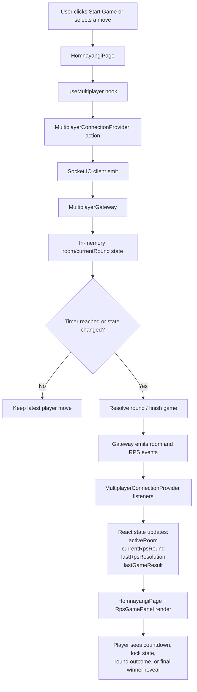

# Phase 9 Baby Steps Code Plan (Frontend RPS UX)

## Summary
Phase 8 established the server-authoritative RPS engine, room resets, and the realtime provider state needed to drive the UI. Phase 9 should turn that backend flow into a complete player experience on `HomnayangiPage`: live countdown, move switching, spectator/elimination messaging, round-result feedback, and final winner reveal before the room returns to lobby.

This plan is intentionally written against the current repo state:
1. `frontend/src/multiplayer/MultiplayerConnectionProvider.tsx` already listens for `game.started`, `rps.round.started`, `rps.round.locked`, `rps.round.resolved`, and `game.finished`.
2. `frontend/src/pages/HomnayangiPage.tsx` already mounts room controls and had a temporary in-game status block.
3. The remaining work is mostly presentation, state hygiene, and making the RPS flow readable for both active players and eliminated spectators.

## Phase 9 Goal
Deliver a polished RPS gameplay layer that feels realtime and understandable:
1. When a round starts, active players instantly see their current move and the time left.
2. Players can switch between `rock`, `paper`, and `scissors` until the server locks the round.
3. Eliminated players stop seeing stale controls and instead get spectator messaging.
4. Every round resolution explains what happened.
5. Game finish reveals only the winning dish and clearly communicates that the room is back in lobby state.

## Component / Event Flow Diagram

## Implementation Changes

### 1. Tighten provider state transitions so the UI never renders stale round data
Files:
`frontend/src/multiplayer/MultiplayerConnectionProvider.tsx`

Change:
1. When `room.joined` or `room.updated` arrives, trust the server snapshot and replace `currentRpsRound` with either the fresh round payload or `null`.
2. Clear old `lastGameResult` when a new game starts or a new round begins.
3. Clear round/result state when the user leaves the room.

Why:
1. Eliminated players should not keep the previous round’s controls.
2. A fresh match should not render the previous winner card.

Checkpoint:
1. `currentRpsRound` always reflects whether this specific user can still play the current round.
2. Round and result cards do not leak across room transitions.

---

### 2. Add a dedicated RPS panel component instead of inline placeholder markup
Files:
`frontend/src/components/RpsGamePanel.tsx`
`frontend/src/components/RpsGamePanel.css`

Build:
1. A focused UI component that accepts:
   1. `room`
   2. `currentUsername`
   3. `currentRound`
   4. `lastResolution`
   5. `lastGameResult`
   6. `onMoveSelect`
2. A local countdown derived from `deadlineAt`.
3. Three move buttons with a selected state and a locked state.
4. Round chips showing who is still active.
5. A spectator/elimination block when the user is no longer active.
6. A winner reveal card after `game.finished`.

Why:
1. `HomnayangiPage` should stay readable.
2. The RPS experience has enough state transitions to deserve its own component boundary.

Checkpoint:
1. The panel is reusable and self-contained.
2. The page no longer relies on temporary inline RPS status markup.

---

### 3. Mount the new RPS panel into the Homnayangi page flow
Files:
`frontend/src/pages/HomnayangiPage.tsx`

Change:
1. Replace the current temporary in-game block with `RpsGamePanel`.
2. Pass `updateRpsMove` down so the panel can emit `rps.move.update`.
3. Keep winner/result visibility tied to multiplayer state instead of one-off local state.

Why:
1. Phase 9 is the UX bridge between provider state and rendered game behavior.
2. The page should present RPS as part of the room lifecycle, not a debug panel.

Checkpoint:
1. Room panel stays above the page content.
2. RPS panel appears during live play and continues to show relevant result/winner feedback as the room returns to lobby.

---

### 4. Design the phase 9 UI for the actual round lifecycle
Files:
`frontend/src/components/RpsGamePanel.tsx`
`frontend/src/components/RpsGamePanel.css`

States to cover:
1. `Lobby + no recent result`
   1. Hide the RPS panel entirely.
2. `In game + active player`
   1. Show round number.
   2. Show countdown.
   3. Show selectable moves.
   4. Show the currently selected move.
3. `In game + eliminated player`
   1. Hide move controls.
   2. Show spectator copy instead.
4. `Round resolved`
   1. Show tie vs elimination summary.
   2. Highlight whether the current player survived.
5. `Game finished / room back to lobby`
   1. Show winner username.
   2. Show winning dish only.
   3. Explain that the room is ready for a rematch.

Checkpoint:
1. UI transitions are understandable without reading console logs.
2. Only the winner’s dish is revealed.

---

### 5. Manual verification for phase 9
Files:
No new files, but required for acceptance.

Run with two or more browser sessions:
1. Both users join a room and choose dishes.
2. Host starts `rps`.
3. Confirm each active user gets a random initial move.
4. Confirm a player can switch moves several times before the round locks.
5. Confirm eliminated players stop seeing active controls.
6. Confirm ties replay cleanly.
7. Confirm the final winner card reveals only the winning dish.
8. Confirm the room is back in lobby and can start another game.

## Definition of Done
1. `HomnayangiPage` shows a real RPS gameplay panel instead of placeholder status text.
2. Countdown and lock state are visible during each round.
3. Players can update their move repeatedly until the round locks.
4. Eliminated users see spectator feedback, not stale controls.
5. Round results and final winner reveal are understandable from the UI alone.
6. The room cleanly transitions from `lobby -> in_game -> result -> lobby`.

## Nice-to-Have Follow-Up After Phase 9
1. Add small round transition animations between `started`, `locked`, and `resolved`.
2. Add compact toast copy for move-updated success only if users need stronger feedback.
3. Persist the last completed match summary in room state if you want a short post-match history panel later.
